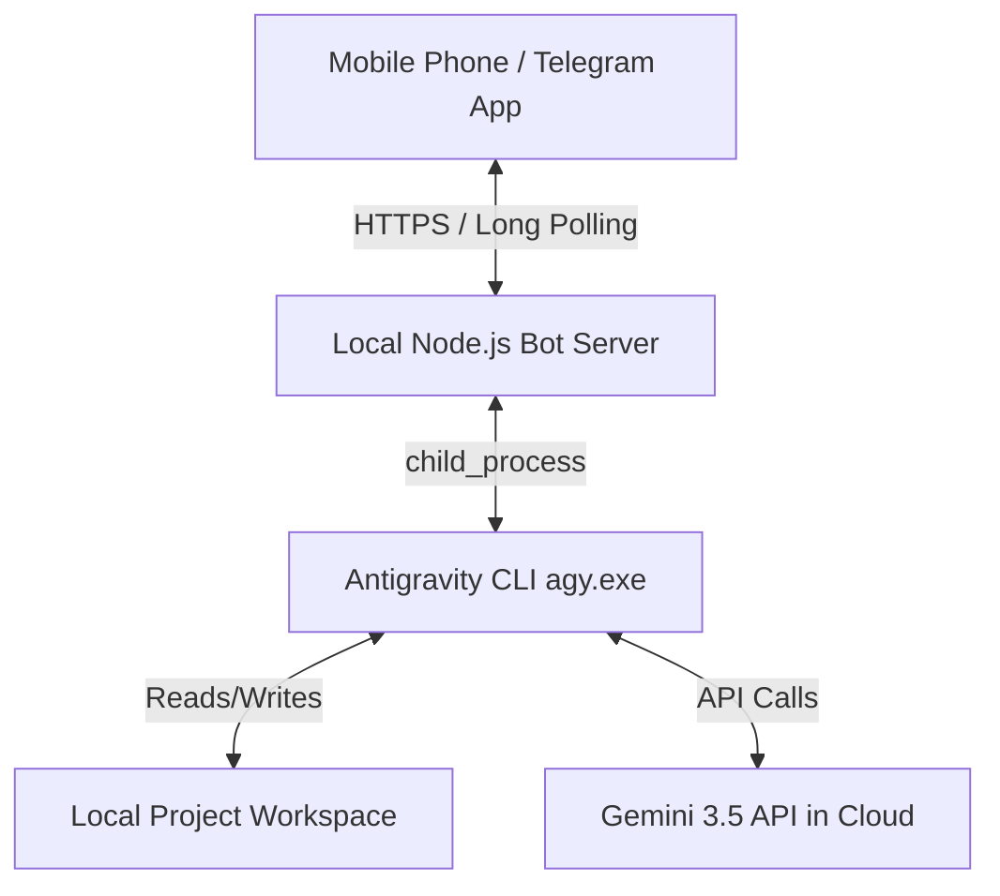

# Specification: Antigravity Remote Dispatch via Telegram Bot

This document details the design and architecture for a self-hosted, 100% free "dispatch" feature for Antigravity. It allows the user to text instructions from their phone via Telegram, which then executes the native Antigravity CLI agent (`agy.exe`) locally on their PC with full capabilities (Gemini 3.5 model, subagents, and tools) and streams progress, git changes, and final walkthrough summaries back to the phone.

---

## 1. System Architecture & Components

The system operates as a single-node, local-only daemon running on the user's PC. It acts as a bridge between the Telegram Bot API and the local Antigravity CLI executable.



### Components:
1.  **Telegram Bot API (Cloud Gateway):** Telegram provides a free cloud interface for receiving messages. The bot communicates exclusively outbound using HTTPS long polling—no inbound connections, webhooks, or open firewall ports are required.
2.  **Local Bot Server (Node.js Daemon):** A background script running on the user's PC that:
    *   Listens for Telegram events.
    *   Manages access control (PIN gate, 20-min session timeout).
    *   Spawns and manages the `agy.exe` process.
    *   Parses, cleans, and streams process output to Telegram.
3.  **Antigravity Executor (`agy.exe`):** The native CLI agent executor installed at `C:\Users\alber\AppData\Local\agy\bin\agy.exe`.
4.  **Local Workspace:** The directory containing the code/files the agent works on.

---

## 2. Security & Session Access Control

Because the bot has command-line execution privileges on the host PC, security is paramount. The design implements multi-layered security:

### A. Telegram Sender Filtering
The bot checks the sender's Telegram `chat.id` against a single `ALLOWED_CHAT_ID` loaded from the local `.env` configuration. Messages from any other account are silently ignored.

### B. PIN Verification Gate
To protect against a stolen or unlocked phone, commands require a PIN code to unlock the session:
1.  **Hashed Storage:** The `.env` file stores a cryptographic hash (e.g., SHA-256) of a user-defined passcode. The raw PIN is never stored on disk.
2.  **Passcode Request:** When a command is sent, if the session is locked, the bot prompts: 
    `🔒 Security Verification: Please enter your passcode to authorize execution.`
3.  **Auto-Deletion:** Immediately upon receiving the PIN, the bot hashes it, compares it to the stored hash, and **calls the Telegram API to delete the plain-text PIN message** from the chat history.
4.  **20-Minute Sliding Timeout:** Successful authorization unlocks the bot. Any command execution resets the timer to **20 minutes**. If no command is executed within 20 minutes, the bot locks again.

### C. Workspace Directory Lock & Path Validation
*   A configuration variable `WORKSPACE_ROOT` defines the top-level directory where the bot is allowed to run commands (e.g., `C:\projects`).
*   **Path Traversal Prevention:** Any path parameter provided by the user or inferred by the bot must be resolved and normalized using Node's `path.resolve()` and `path.normalize()`. The bot then uses `fs.realPathSync()` to resolve symlinks and checks if the resulting absolute path starts with the absolute path of `WORKSPACE_ROOT`. Any path escaping this boundary is rejected.

---

## 3. Command & Session Management

### Command List:
*   `/run <task>`: Launches a new Antigravity session.
    *   *Example:* `/run design a react modal component`
*   `/continue <prompt>` (or `/c <prompt>`): Resumes the most recent conversation session.
*   `/status`: Returns whether an agent is running, elapsed time, and the latest 3 lines of output.
*   `/stop`: Force-terminates the currently running `agy.exe` process and its entire child process tree. On Windows, this is achieved by calling `taskkill /T /F /PID <pid>` to prevent orphaned background processes (e.g., compilers, dev servers, or Git runs) from continuing to run. On Linux/macOS, it kills the process group.
*   `/lock`: Immediately locks the session, requiring a PIN for the next execution.
*   `/workspace <path>`: Sets the target directory (must reside inside `WORKSPACE_ROOT`).
*   `/model <name>`: Gets or sets the reasoning model by reading/writing to the persistent `~/.gemini/antigravity-cli/settings.json` file.
    *   *Example:* `/model Gemini 3.5 Pro`

### Executing `agy.exe`:
When spawning `agy.exe`, the bot uses `child_process.spawn` and appends:
*   `--prompt "<user text>"`
*   `--dangerously-skip-permissions` (ensures autonomous work without GUI dialogs)
*   `--add-dir "<workspace path>"`
*   If `/continue` is used, it adds `--continue` or `--conversation <id>` to resume the previous thread context.

---

## 4. Real-Time Log Streaming & Interaction

### A. Output Processing & Rate Limiting
1.  **ANSI Stripping:** All terminal colors and control characters (e.g., `\u001b[...]`) are stripped from `stdout`/`stderr` chunks.
2.  **Spinner Filtering:** Progress spinners and duplicate carriage returns (`\r`) are filtered out to keep output readable.
3.  **Milestone Capture:** The bot detects state changes and texts high-level milestones:
    *   🚀 *Starting task...*
    *   📂 *Analyzing files...*
    *   💻 *Executing:* `npm run build`
    *   ✏️ *Writing file:* `src/components/Modal.jsx`
4.  **Rate-Limited Buffering & Truncation:** Raw stdout is buffered and sent in batches (e.g., every 10 seconds). Each buffered message is strictly capped at **4,000 characters** to stay under Telegram's 4,096 character limit and prevent API rate-limit bans for massive outputs. If it exceeds 4,000 characters, it is truncated and appended with `...[truncated]`.

### B. Interactive Handover & Stdin Idle Timeout
*   **Bidirectional Input:** If the agent prompts the user for clarification, the bot forwards the question to Telegram. The user's reply is piped directly into the `stdin` of the running `agy.exe` process.
*   **Idle Timeout Security:** To prevent the bot from hanging indefinitely when the process is waiting silently on `stdin` (or if the question detection regex fails), the bot enforces a **5-minute activity timeout** on the process output stream. If no stdout/stderr activity occurs for 5 minutes, the bot alerts the user: *"⚠️ Process has been idle/waiting for 5 minutes. Reply to this message to send input, or type /stop to kill the task."*

### C. Task Completion & Walkthrough
Upon exit:
1.  **Git Change Inference:** The bot runs `git diff --stat` (or compares file timestamps if git is not used) to compile a summary of modified and created files.
2.  **Walkthrough Summary:** The bot extracts the final summary/walkthrough printed by Antigravity and sends it.
3.  **Exit Status:** The bot reports whether the process exited cleanly (exit code `0`) or failed.

---

## 5. Deployment & Configuration

### File Structure:
```
/dispatch-for-antigravity
  ├── index.js          # Entry point (Telegram bot listener & process manager)
  ├── package.json      # Dependencies (grammy, dotenv, etc.)
  ├── .env.example      # Example environment variables configuration
  └── .env              # Local configurations (Gitignored)
```

### `.env` Structure:
```env
TELEGRAM_BOT_TOKEN=your_bot_token_here
ALLOWED_CHAT_ID=your_telegram_chat_id
HASHED_PIN=sha256_hashed_pin_here
WORKSPACE_ROOT=C:\projects
DEFAULT_WORKSPACE=C:\projects\my-app
ANTIGRAVITY_PATH=C:\Users\alber\AppData\Local\agy\bin\agy.exe
```

---

## 6. Verification & Testing Plan

### Automated/Unit Tests:
*   Test that the PIN hashing logic matches verification inputs.
*   Test that the timeout sliding window resets on execution and locks correctly after 20 minutes of inactivity.
*   Test that the workspace folder resolution rejects paths resolving outside `WORKSPACE_ROOT` (e.g., `..\..\Windows`).
*   Mock `child_process.spawn` to verify correct arguments are passed to `agy.exe`.

### Manual Testing:
1.  Configure a test bot and send messages from unauthorized accounts to verify they are ignored.
2.  Send a `/run` command without authorization to verify the PIN gate prompts.
3.  Enter the PIN and verify the bot deletes the PIN message from history.
4.  Run a test compile job (e.g., a simple python script) to verify stdout milestones are formatted and streamed.
5.  Send a `/stop` command during execution to verify the child process is terminated cleanly.
